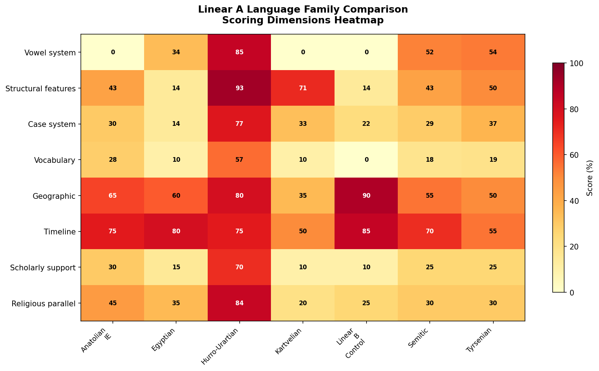
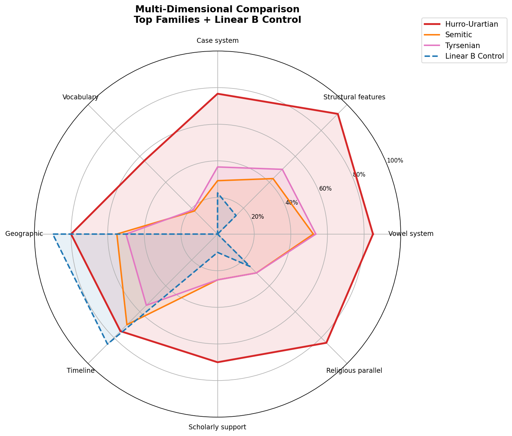
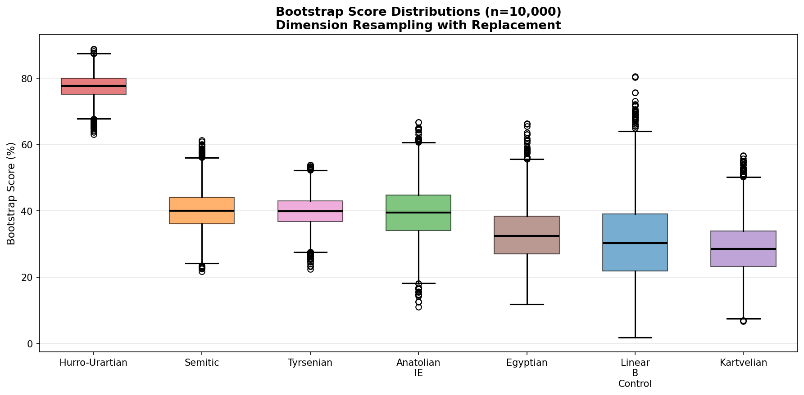
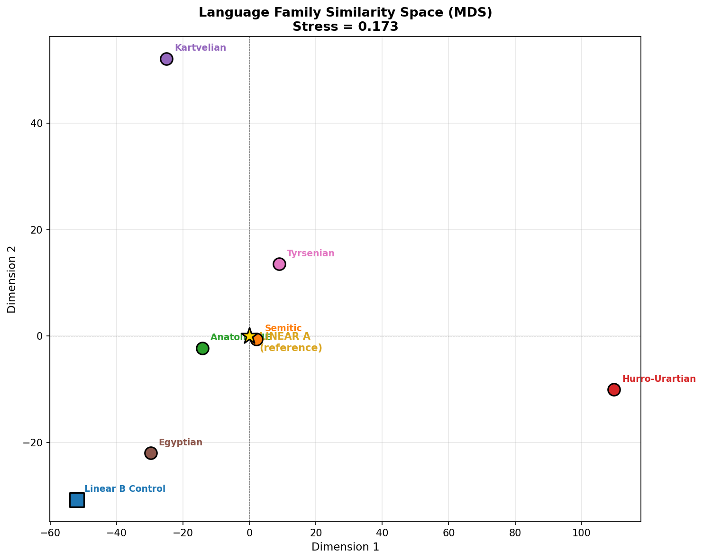
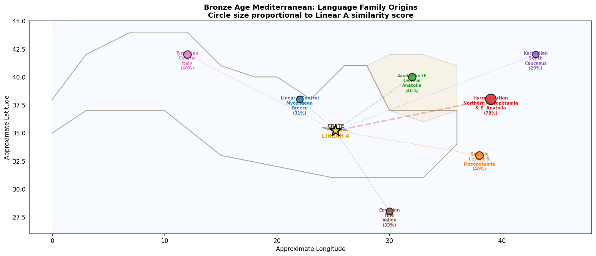

# Linear A Computational Analysis

Computational structural analysis of the Minoan Linear A script (~1850-1450 BCE). This project applies information-theoretic, morphological, and cross-domain methods to extract linguistic structure from the undeciphered corpus without requiring a bilingual text.

## What This Is

Linear A is one of the last major undeciphered writing systems. These scripts analyze the ~1,427 known inscriptions using computational methods to:

- Test proposed grammatical rules against the libation formula corpus (41 variants)
- Measure information-theoretic properties (Shannon entropy, bigram predictability)
- Compare the Minoan sound system against candidate language families
- Apply statistical controls (permutation testing, ablation, perturbation analysis)
- Evaluate cross-domain convergence across linguistic, archaeological, and genetic evidence
- **Validate methodology using Linear B (Mycenaean Greek) as a negative control**

## Key Findings

- **6/6 morphological agreement rules confirmed** with zero exceptions across the libation formula corpus
- **Shannon entropy of 4.70 bits/sign** — squarely in the natural language range
- **9/9 administrative structural features** match other Bronze Age accounting systems
- **Vowel distribution** (a=43%, i=21%, u=18%, e=14%, o=4%) matches Beekes' reconstructed pre-Greek three-vowel system
- Hurro-Urartian shows strongest overall fit at **77.5%** across 8 dimensions, with a **37-point gap** over the next candidate (Semitic at 40.3%)
- **Linear B negative control validates methodology**: Mycenaean Greek scores 30.8% — a known IE language is correctly identified as dissimilar to Linear A
- **Bootstrap confidence**: P(Hurro-Urartian = #1) = 100.0% across 10,000 resampled iterations

## Visualizations

The control validation script generates 5 publication-quality figures:

### Scoring Heatmap


### Multi-Dimensional Radar Chart


### Bootstrap Score Distributions


### Language Family Similarity Space (MDS)


### Bronze Age Mediterranean Geographic Map


## Scripts

| Script | Description |
|--------|-------------|
| `LINEAR_A_CONTROL_VALIDATION.py` | **NEW** — Linear B negative control, expanded 38-item vocabulary, 5 visualizations, source documentation, honest assessment |
| `LINEAR_A_STRUCTURAL_ANALYSIS.py` | Core analysis: libation formula corpus, morphological rule testing, information theory, sign frequency, co-occurrence networks |
| `LINEAR_A_PHONOLOGICAL_ANALYSIS.py` | Sound system analysis: phonotactics, vowel harmony, consonant clusters, syllable structure, rhythm patterns |
| `LINEAR_A_HURRIAN_COMPARISON.py` | Systematic Hurrian grammar comparison: case system mapping, vocabulary, verbal morphology |
| `LINEAR_A_ENHANCED_COMPARISON.py` | Extended comparison with pre-Greek substrate, Urartian three-way analysis, Van Soesbergen readings |
| `LINEAR_A_STATISTICAL_CONTROLS.py` | Reviewer-proof controls: baseline distributions across 6 language families, ablation, permutation testing, sign-reading perturbation |
| `LINEAR_A_CROSS_DOMAIN_CONVERGENCE.py` | Bayesian convergence across 8 independent evidence domains (linguistic, archaeogenetic, maritime trade, material culture, religious iconography, etc.) |
| `LINEAR_A_TRANSLATION_ATTEMPT.md` | Full writeup: established facts, analysis results, proposed translations, confidence levels, honest assessment of unknowns |

## Running

The core analysis scripts use only the Python 3 standard library. The control validation script requires `matplotlib` and `numpy` for visualizations.

```bash
# Core analysis (no dependencies)
python3 LINEAR_A_STRUCTURAL_ANALYSIS.py
python3 LINEAR_A_STATISTICAL_CONTROLS.py
python3 LINEAR_A_CROSS_DOMAIN_CONVERGENCE.py

# Control validation with visualizations (requires matplotlib, numpy)
pip install matplotlib numpy
python3 LINEAR_A_CONTROL_VALIDATION.py
```

## Methodology

**Confidence protocol**: Every claim is tagged `[HIGH]`, `[MEDIUM]`, `[LOW]`, or `[SPECULATIVE]`.

The approach treats Linear A as a systems analysis problem rather than a purely linguistic one:

1. **Structural analysis** — Variant comparison across 41 libation formula inscriptions reveals grammatical agreement rules
2. **Administrative pattern matching** — Cross-cultural comparison with Sumerian, Egyptian, and Linear B accounting systems
3. **Statistical controls** — Every proposed pattern is tested against null hypotheses and competing language families
4. **Cross-domain convergence** — Independent evidence streams (DNA, trade networks, material culture) evaluated via Bayesian updating
5. **Negative control validation** — Linear B (deciphered Mycenaean Greek) run through the same pipeline to verify methodology doesn't produce false positives

### The Circular Reasoning Problem (acknowledged)

Using Linear B phonetic values to read Linear A introduces a Greek phonological filter. Our strongest evidence comes from morphological and structural patterns (agglutination, case agreement, word order) which are less affected by specific phonetic value assignments than vocabulary comparisons.

## Data Sources

### Primary Corpus
- **SigLA Database** (Salgarella & Castellan, 2020) — ~3,000 signs from ~400 inscriptions
- **GORILA Corpus** (Godart & Olivier, 1976-1985) — 5 volumes, ~1,427 inscriptions, ~7,362 sign tokens
- **Younger, J.G.** — Linear A Texts in Phonetic Transcription (University of Kansas)

### Reference Grammars
- Wegner (2007) & Wilhelm (1989) — Hurrian
- Salvini (2008) & Diakonoff (1971) — Urartian
- Hoffner & Melchert (2008) — Hittite
- Huehnergard (2011) — Akkadian
- Allen (2014) — Egyptian
- Rix (2004) & Bonfante (2002) — Etruscan
- Hewitt (1995) — Kartvelian
- Ventris & Chadwick (1956, 1973) — Mycenaean Greek

### Pre-Greek Substrate
- Beekes (2010) "Etymological Dictionary of Greek" — 700+ non-IE words identified
- Beekes (2014) "Pre-Greek: Phonology, Morphology, Lexicon"

### Vocabulary Comparison
- **38 items** across 7 language families (6 competing + 1 control)
- Categories: established Linear A words, morphological suffixes, pre-Greek substrate, administrative terms, libation formula elements

## License

MIT
